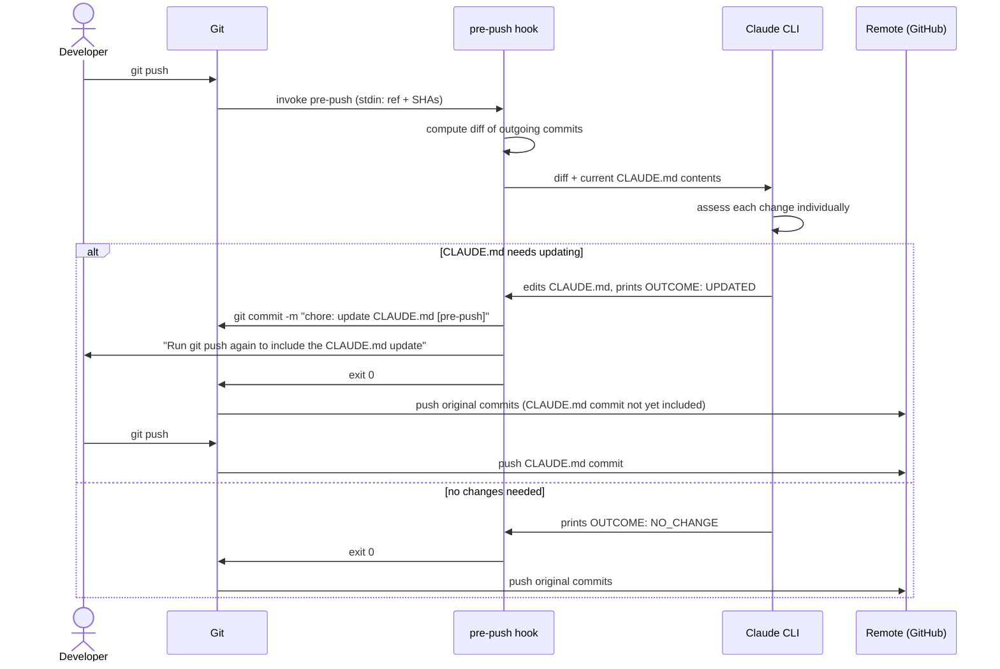

# claude-git-hooks

Git hooks that use [Claude Code](https://claude.ai/code) to keep your project context up to date automatically.

## Hooks

### `pre-push` — Auto-update CLAUDE.md

Before each push, reviews the outgoing commits and updates `CLAUDE.md` if it no longer accurately reflects the codebase. If `CLAUDE.md` doesn't exist yet, Claude will create it from scratch.

If Claude updates `CLAUDE.md`, a new commit is created automatically and you are asked to run `git push` again to include it.

#### Prerequisites

- [Claude Code](https://claude.ai/code) CLI installed and authenticated (`claude` command available in PATH)

#### Install (global — applies to all repos)

```bash
mkdir -p ~/.githooks
curl -o ~/.githooks/pre-push https://raw.githubusercontent.com/edwarddamato/claude-git-hooks/main/pre-push
chmod +x ~/.githooks/pre-push
git config --global core.hooksPath ~/.githooks
```

#### Install (single repo)

```bash
curl -o .git/hooks/pre-push https://raw.githubusercontent.com/edwarddamato/claude-git-hooks/main/pre-push
chmod +x .git/hooks/pre-push
```

#### How it works

1. Computes the diff of commits about to be pushed, skipping any commits that only touch `CLAUDE.md`
2. Passes the diff alongside the current `CLAUDE.md` contents to `claude --print`, asking it to verify that CLAUDE.md gives an accurate picture of the project after the changes
3. If `CLAUDE.md` is modified, a new `chore: update CLAUDE.md [pre-push]` commit is created and you are asked to run `git push` again to include it
4. If no changes are needed, the original push continues uninterrupted

If the `claude` CLI is not found, the hook warns and exits without blocking the push.

#### Flow


