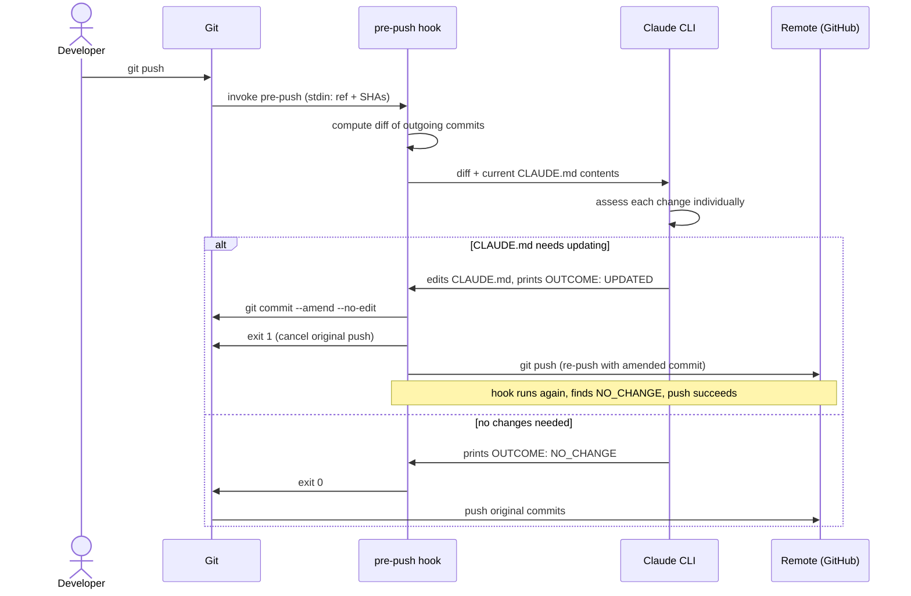

# claude-git-hooks

Git hooks that use [Claude Code](https://claude.ai/code) to keep your project context up to date automatically.

## Hooks

### `pre-push` — Auto-update CLAUDE.md

Before each push, reviews the outgoing commits and updates `CLAUDE.md` if any architecturally significant changes are detected (new commands, env vars, dependencies, patterns, config changes). Skips silently for trivial changes like bug fixes, UI tweaks, or test-only commits.

If Claude updates `CLAUDE.md`, you are prompted to amend your last commit before the push continues.

#### Prerequisites

- [Claude Code](https://claude.ai/code) CLI installed and authenticated (`claude` command available in PATH)
- A `CLAUDE.md` file at the root of your repo (the hook skips repos without one)

#### Install (global — applies to all repos)

```bash
mkdir -p ~/.githooks
curl -o ~/.githooks/pre-push https://raw.githubusercontent.com/edwarddamato/claude-git-hooks/main/pre-push
chmod +x ~/.githooks/pre-push
git config --global core.hooksPath ~/.githooks
```

#### Install (single repo)

```bash
curl -o .git/hooks/pre-push https://raw.githubusercontent.com/edwarddamato/claude-git-hooks/main/pre-push
chmod +x .git/hooks/pre-push
```

#### How it works

1. Computes the diff of commits about to be pushed
2. Passes the diff (alongside current `CLAUDE.md` contents) to `claude --print` with instructions to assess every change individually and update `CLAUDE.md` if anything is stale or undocumented
3. If `CLAUDE.md` is modified, cancels the original push, amends the last commit, then re-pushes — the hook runs again on the re-push, finds no further changes, and the push succeeds normally
4. If no changes are needed, the original push continues uninterrupted

If the `claude` CLI is not found, the hook warns and exits without blocking the push.

#### Flow


